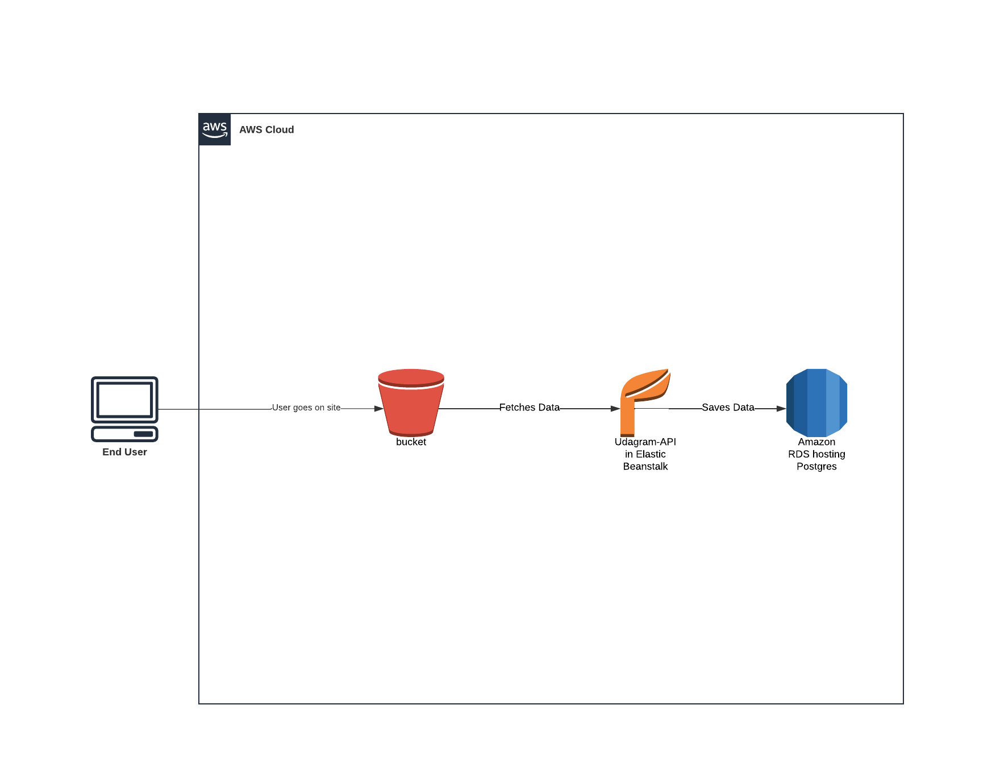

# Udagram AWS Deployment
  
Udagram is a full stack web application that allows users to log in and post pictures. This project deploys it to **AWS** so that it is available to customers. The application contains the main components of a 3-tier full stack application (**UI**, **API**, and **Database**). The services and infrastructure are configured on AWS. **CircleCI** is used for automated pipeline.

The application can be interacted using the following link, which is hosted by AWS S3 static web hosting service:

http://my-udagram-bucket.s3-website-us-east-1.amazonaws.com

The backend is delpoyed on:
http://udagram-api-dev2.us-east-1.elasticbeanstalk.com/

## Architecture Diagram

AWS Elastic beanstalk is used for deploying backend application, which resides in `/udagram-api` folder.

AWS RDS is used for the postgres database on the cloud.

AWS S3 bucket is used for storing object files, as well as the frontend application, which resides in `/udagram-frontend`.

More information about the infrastructure and application dependencies are included in `/document` folder.

## CircleCi Pipeline Diagram

More information about the infrastructure, application dependencies and pipeline are included in `/document` folder.
  
## Configuration Screenshots

## AWS

### RDS

### S3 

### Elastic Beanstalk

## CircleCI Pipeline

The following environment variables were used:

# Dependencies  
  

- Node v14.15.1 (LTS) or more recent. While older versions can work it is advisable to keep node to latest LTS version  
  
- npm 6.14.8 (LTS) or more recent, Yarn can work but was not tested for this project  
  
- AWS CLI v2, v1 can work but was not tested for this project  
  
- A RDS database running Postgres.  
  
- A S3 bucket for hosting uploaded pictures.  
  
# Built With  
  
- [Angular](https://angular.io/) - Single Page Application Framework  
- [Node](https://nodejs.org) - Javascript Runtime  
- [Express](https://expressjs.com/) - Javascript API Framework  
  
# License  
  
[License](LICENSE.txt)
